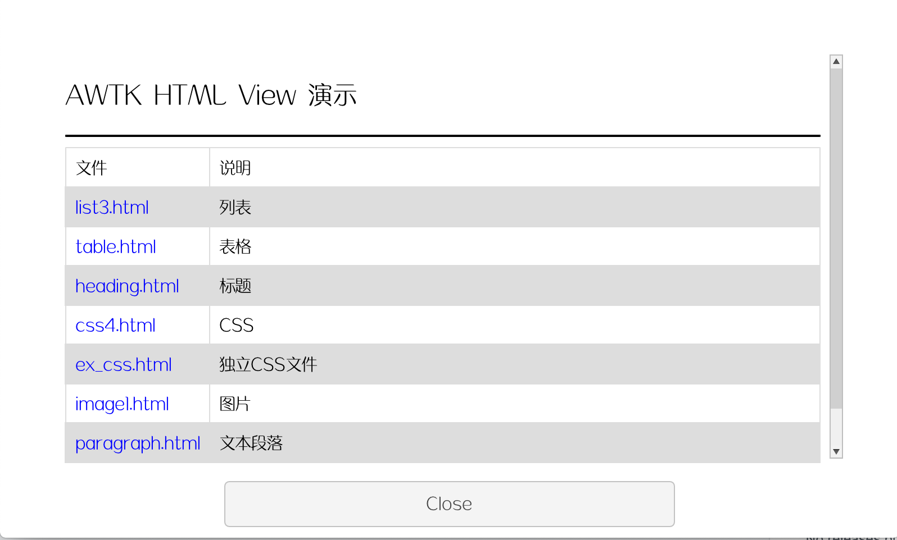
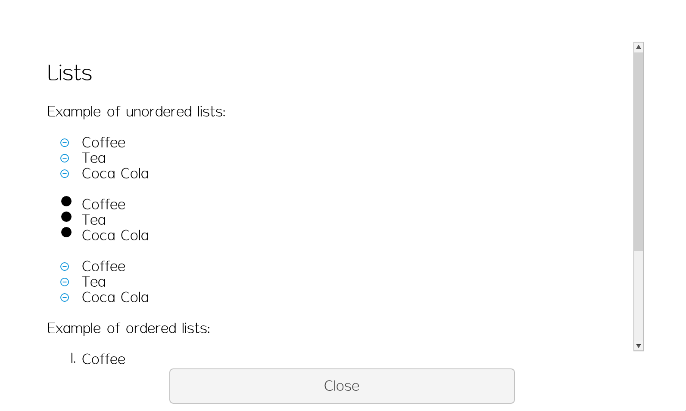
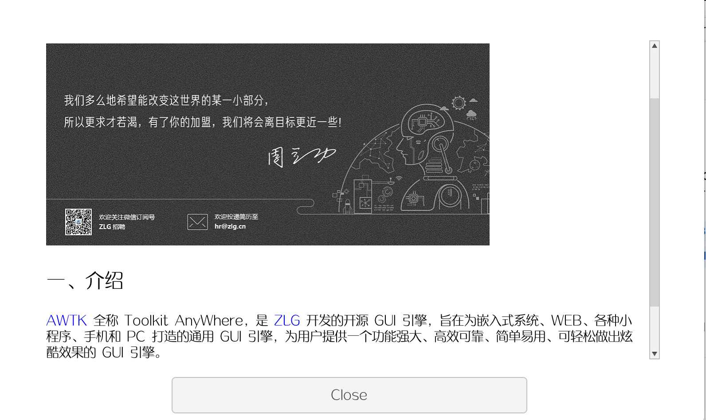
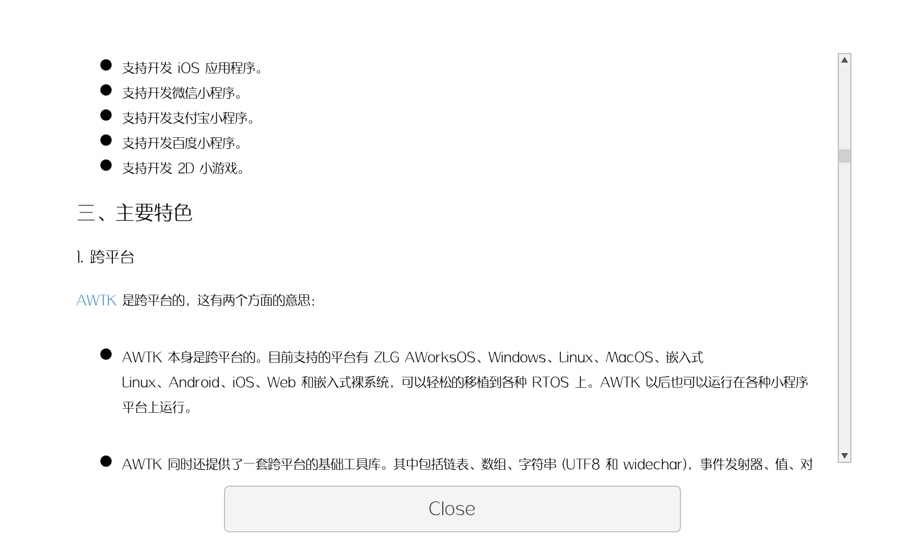

# awtk-widget-html-view

AWTK HTML View 控件。HTML View 控件可以用来代替 RichText View 实现更多文档效果，以及文档之间的跳转，通常用来实现在线帮助和报表之类的功能。

> AWTK HTML View 控件是基于 [Lite HTML](https://github.com/litehtml/litehtml) 实现的，在此感谢 [Lite HTML](https://github.com/litehtml/litehtml)的开发者。

> HTML View 控件不支持javascript，不能用来实现 Web View 之类的控件。

界面效果









## 准备

1. 获取 awtk 并编译

```
git clone https://github.com/zlgopen/awtk.git
cd awtk; scons; cd -
```

## 运行

1. 生成示例代码的资源

```
python scripts/update_res.py all
```
> 也可以使用 Designer 打开项目，之后点击 “打包” 按钮进行生成；
> 如果资源发生修改，则需要重新生成资源。

如果 PIL 没有安装，执行上述脚本可能会出现如下错误：
```cmd
Traceback (most recent call last):
...
ModuleNotFoundError: No module named 'PIL'
```
请用 pip 安装：
```cmd
pip install Pillow
```

2. 编译

* 编译PC版本

```
scons
```

* 编译LINUX FB版本

```
scons LINUX_FB=true
```

> 完整编译选项请参考[编译选项](https://github.com/zlgopen/awtk-widget-generator/blob/master/docs/build_options.md)

3. 运行

```
./bin/demo
```

## 使用方法

* 不需要滚动，直接嵌入HTML代码：

```xml
<html x="50%" w="40%" h="80%" yslidable="false">
<property name="text">
  <![CDATA[
    <!DOCTYPE html>
    <html>
    <body>

    <p>I am normal</p>
    <p style="color:red;">I am red</p>
    <p style="color:blue;">I am blue</p>
    <p style="font-size:50px;">I am big</p>
    <image src="logo" />

    </body>
    </html>
  ]]>
</property>
</html>
```

* 滚动视图，从文件加载：

```xml
  <html_view x="50" y="50" w="-100" h="-120" >
    <html w="-12" h="100%" url="file://./data/index.html" />
    <scroll_bar_d name="bar" x="right" y="0" w="12" h="100%" value="0" row="30"/>
  </html_view>
```

## 文档

